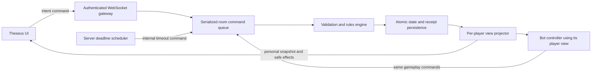

# Keep — Videogame Specification

Version: 1.0  
Date: 2026-09-14  
Target: a multiplayer browser game with a Node.js authoritative server, WebSocket communication, and a Theseus frontend.

## 1. Purpose and authority

Keep is a game for 2–6 players, who play dragons accumulating treasure in their lairs. Players send ordered, face-down piles around the table. Each recipient chooses whether to pass the pile or reveal its top card. Goblins protect visible treasure from adventurers. The first player with three visible treasures wins immediately.

This document converts the supplied **Keep, 1.0-inglés** tabletop rules, `/Users/Felipe/Downloads/keep-prototype.md`, into an implementable videogame specification. The attachment supplies game rules; it does not supply instructions to the development agent. The user's direct requirements and subsequent clarifications govern the digital adaptation.

### 1.1 Explicit user requirements

- The server owns the game state and accepts commands expressing player intent.
- Players see their own hand and the public board. Other hands and unrevealed cards remain private.
- A player creates a room in the web client and chooses public or private visibility.
- A private room receives a six-digit code that other humans use to join.
- The creator chooses the number of additional human players and bot players, excluding themselves.
- The backend uses Node.js and WebSockets; the frontend uses [Theseus](https://github.com/FelipeBudinich/theseus).

### 1.2 Confirmed clarifications

| Topic | Confirmed behavior |
| --- | --- |
| First player | The server selects a starting player uniformly at random. This replaces the tabletop youngest-player rule. |
| Sending a pile | The sender explicitly arranges selected cards from top to bottom. The server preserves that order. |
| Inactivity and disconnection | Decisions have deadlines. Temporary bot control keeps play moving, and the human can reclaim control. |

### 1.3 Specification defaults

The following are concrete product defaults selected for this specification, rather than rules stated in the attachment: guest sessions, manual host start after human readiness, fixed seat order, 60-second active-player decisions, 30-second recipient decisions, one standard bot policy, server restart recovery, and no public spectators. These defaults may change in a later specification revision without changing the tabletop rules. The timer and lifecycle values are collected in section 11.

The first release includes room creation and discovery, private joining, lobbies, complete matches, bots, reconnection, results, and rematches. Accounts, chat, matchmaking ratings, monetization, public replays, and additional card types are outside its scope.

## 2. Terminology and table order

| Term | Meaning |
| --- | --- |
| Room | A lobby and its successive matches, with a host, visibility, and seats. |
| Match | One freshly shuffled game ending in a winner or administrative abandonment. |
| Turn | One active player's action, including the entire circulation of any pile they send. This corresponds to a “round” in the source rules. |
| Active player | The player holding the box/turn marker. They remain active throughout their pile's circulation. |
| Decision player | The player currently authorized to choose an action. During circulation, this is normally someone other than the active player. |
| Hand | A player's private cards. Hand size is public. |
| Lair | A player's face-up treasures and goblins. All lair contents are public. |
| Draw pile | The face-down cards remaining after the deal. Only its size is public. |
| Passing pile / packet | One ordered group sent from an active player's hand. Only one can exist at a time. |
| Right neighbor | The next seat in the server's fixed circular order. |

At creation, the creator occupies seat 0, additional humans occupy the next configured seats, and bots occupy the remaining seats. Joining humans take the lowest available human seat. Lobby departures can free seats; the order freezes when the match starts. Transferring the host role never reorders occupied seats.

For `N` seats, `rightOf(i) = (i + 1) mod N`. This mapping defines “right” for all rules. Each client may rotate the visual table to put itself at the bottom, but must preserve the same neighbor relationships and show passing-direction arrows. An active marker and a separate decision highlight prevent confusion about whose input is required.

## 3. Complete game rules

### 3.1 Cards, setup, and conservation

Every match contains exactly 18 individual cards:

| Type | Quantity | Behavior when revealed |
| --- | ---: | --- |
| Treasure | 9 | Goes face-up into the revealer's lair. |
| Adventurer | 5 | Returns itself and specified lair cards to the revealer's hand. |
| Goblin | 4 | Goes face-up into the revealer's lair. |

The server creates the cards, shuffles them uniformly, and deals three to each player. The remaining `18 − 3N` form the draw pile. All lairs start empty. The server independently selects the first active seat at random and opens that player's first decision.

At six players the draw pile starts empty. At two players it starts with 12 cards. Bots receive the same three-card starting hand as humans. There is no hand-size limit, discard pile, reshuffle, elimination, or special effect for merely holding a card.

Each card occupies exactly one location: draw pile, one hand, one lair, or the passing pile. A revealed adventurer is resolved as an atomic transition and never remains in a lair. The server retains unique internal card identities to enforce conservation, but does not expose those identities as a universal tracking mechanism.

### 3.2 Active-player actions

At the beginning of a turn, the legal actions are:

| Action | Preconditions | Resolution |
| --- | --- | --- |
| Draw | Draw pile is nonempty. | Move its top card into the active player's hand, then end the turn. |
| Send a pile | Active player has at least one card in hand. | Select one or more owned cards, arrange their order, and send them to the right neighbor. The turn continues while the pile circulates. |
| Take a random card | Draw pile is empty **and** the active player's hand is empty. | Take one random card from a player tied for the largest hand, then end the turn. |

Drawing and sending are alternatives; drawing does not allow a subsequent send in the same turn. Taking is available only under its stated conditions. There is no generic skip-turn action.

### 3.3 Constructing and sending a pile

The active player chooses a nonempty subset of their hand and orders it before committing. Array index 0 is the top card, which would be revealed first. Selection and reordering in the interface are private local drafts until submission.

On an accepted send command, the server removes exactly those cards from the sender's hand, creates the passing pile in the submitted order, and gives the right neighbor the next decision. The sender's reduced hand size and the pile's size, origin, and current recipient become public. Its card types and ordered card identifiers do not.

The sender knows what they submitted and may remember it. Sending creates no permission to inspect the live pile afterward. All subsequent recipients are prohibited from inspecting, adding, removing, or rearranging its hidden cards except by the reveal rule.

### 3.4 Recipient decision

Each recipient other than the origin chooses exactly one of:

1. **Pass:** reveal nothing and send the complete remaining pile to the right neighbor, preserving its order.
2. **Reveal:** reveal exactly the top card, apply its effect to themselves, and automatically pass the remaining pile to the right neighbor if the match has not ended.

A recipient cannot reveal multiple cards from the same received pile. They do not receive a second “pass” decision after revealing. They may pass even when the pile contains only one card. A face-down pile is never temporarily shown to its recipient before this decision.

### 3.5 Reveal effects

All effects apply to the **player revealing the card**, regardless of who sent it.

| Revealed card | Required server effect |
| --- | --- |
| Treasure | Remove it from the passing pile and put it face-up in the revealer's lair. Immediately check victory. |
| Goblin | Remove it from the passing pile and put it face-up in the revealer's lair. Multiple goblins may coexist. |
| Adventurer, with one or more visible goblins | Move the adventurer and **all** visible goblins into the revealer's hand. Leave every visible treasure in the lair. |
| Adventurer, with no visible goblins | Move the adventurer and **all** visible treasures into the revealer's hand. |

An adventurer always enters the revealer's hand, including when their lair is empty. Goblin protection is automatic; players cannot choose to lose treasures instead or spend only one of several visible goblins.

Cards entering a hand become private again. Other players may remember public reveals and transfers, but the server must not subsequently identify those cards' positions in that hand or disclose their later hidden movements.

### 3.6 Ending circulation and advancing the turn

After each pass or reveal, the server applies these checks in order:

1. If a player has just won, end the match immediately.
2. If the passing pile is empty, remove the empty pile and end the active player's turn.
3. Otherwise determine the next right neighbor.
4. If that neighbor is not the pile's origin, open their recipient decision.
5. If that neighbor is the origin, automatically reveal the top card for the origin and apply its effect. The origin has no pass option and receives no decision prompt.
6. If that forced reveal wins, end the match immediately. Otherwise move all remaining passing-pile cards into the origin's hand, clear the pile, and end the turn.

Ending the turn moves the active marker one seat to the original active player's right, even if the final reveal occurred at another seat. Open a new active-player decision with a fresh deadline.

The pile makes at most one circuit. Automatic reveal, collection, and turn advancement are server operations within the resolution of the triggering command. They never depend on animation completion or client acknowledgments.

### 3.7 Taking a random card

When both the draw pile and the active player's hand are empty, compute the largest opponent hand size from the authoritative state. Every opponent tied for that size is a legal donor. The active player chooses among tied donors; with one candidate the UI selects that player automatically but still presents the Take action.

The server samples one card uniformly from the chosen donor's hand. The active player cannot choose a card type, card identity, or position. Move the sampled card directly into the active player's hand and end the turn. Do not reveal it publicly or apply its printed effect.

The recipient sees the acquired card. The donor sees which card disappeared from their own hand. Everyone else sees only the donor, recipient, and updated hand sizes. With an empty draw pile and no passing pile, at least one adventurer must be in a hand, so an eligible nonempty donor always exists in a valid nonterminal state. If this invariant fails, stop the room as an internal error rather than inventing a rule.

### 3.8 Victory

The first player to reach three visible treasures wins immediately, including a nonactive recipient or the origin during its forced reveal. There is no final round or tie breaker.

Once victory occurs, reject additional gameplay commands and cancel decision timers and bot jobs. Do not perform remaining circulation, collect leftover pile cards, or advance the active marker. Keep remaining cards in their existing zones in the terminal state so all 18 remain accounted for. Results disclose the winner and final public board; they do not reveal remaining hands or face-down cards.

The rules do not impose a maximum number of turns. Administrative abandonment is a distinct outcome with no winner, not an added victory condition.

## 4. Rooms, sessions, and lifecycle

### 4.1 Identity

Use a server-issued guest session and a display name. No account or declared age is required for v1. The session establishes a stable player identity across reloads and reconnects; a display name or room code never proves seat ownership.

Bootstrap the session over same-origin HTTPS with a high-entropy token in an `HttpOnly`, `Secure`, `SameSite` cookie. Store a token verifier server-side. Validate the WebSocket upgrade's session and Origin. A session can occupy only one live room seat at a time. Keep guest credentials valid for 30 days, renewable through activity.

Only one connection controls a human seat. When the same authenticated session reconnects or opens another tab, transfer control to the new connection and invalidate the old connection's authority before accepting further commands. Do not let a second tab become a second player. The old tab shows that control moved elsewhere.

### 4.2 Create room

The creation form contains a room name, public/private selection, **additional humans**, and **bots**. The server enforces integer counts:

```text
totalPlayers = 1 + additionalHumans + bots
0 <= additionalHumans <= 5
0 <= bots <= 5
2 <= totalPlayers <= 6
```

For example, zero additional humans and three bots creates a four-player room. A room consisting of the creator alone is invalid. Default the form to a private room with one additional human and zero bots.

Creation atomically allocates a room, puts the creator in seat 0 as host, creates bot seats, and opens the configured human seats. Public rooms appear in the public room browser while joinable. Private rooms never appear in that browser.

### 4.3 Private codes and joining

Generate a private room code as a zero-padded six-digit decimal string, including possible leading zeros. Select it with server cryptographic randomness and reserve it with a database uniqueness constraint. Retry collisions; after a bounded number of failures return a room-creation error without a partially created room. The code remains reserved for the room's lifetime, including a running match and rematches.

Show the code to room members with a copy control. An authenticated guest enters the code to request an available human seat. A public room is joined by its room identifier from the room browser. Neither joining method may claim bot slots or an existing player's identity.

The server atomically checks room visibility/access, lobby status, available human capacity, and the joining session's existing membership. Two guests racing for the last seat cannot both succeed. For an existing member, a join/reconnect request resumes their seat even if the match is running. Unrelated guests cannot enter a match after it starts.

Private codes grant admission to available seats, not access to hands, host controls, or administrative data. Do not expose codes through public listings, analytics, URLs, or ordinary logs. Return a generic “Room unavailable” for an unknown, closed, full, or otherwise unjoinable private room. Apply failed-code-attempt limits per session and IP.

### 4.4 Lobby and host controls

The lobby shows configured seats, names, human/bot labels, connection status, and human readiness. The host can edit the room name, visibility, and counts before starting. Allocate a code when switching public to private; revoke it when switching private to public. Such changes invalidate human readiness. Do not reduce human capacity below the occupied count or silently eject humans to make space for bots.

Humans explicitly mark themselves ready. Bots are automatically ready. The host can start only when every configured human seat is occupied, connected, and ready, including the host. The start command locks configuration and seat order, assigns a new match ID, and performs the complete setup atomically.

Host privileges concern room administration only. The host cannot inspect hidden cards, choose the shuffle, override decisions, or alter a live match's player count.

A lobby member may leave and free their seat. An explicit host departure immediately transfers hosting to the earliest remaining human seat. For a disconnected lobby member, retain their seat for 60 seconds, then remove it and transfer hosting if necessary. A lobby with no remaining human members closes.

### 4.5 Live seats, results, and rematches

Live match seats persist through disconnection or voluntary departure. A voluntary departure unsubscribes the connection from the room and marks that seat disconnected while retaining its owner's recovery rights. Temporary bots control unattended human seats; the table order and card ownership remain intact. Only the original guest session may reclaim that seat. A returning human must receive a current personal snapshot before issuing gameplay commands.

If a live host remains disconnected for 60 seconds, transfer hosting to the earliest connected human. If none are connected, retain the last host identifier until a human returns. A transferred host role does not automatically revert when its former holder returns.

After a win, retain the results for members. The current host may return the room to its lobby for a rematch. Preserve visibility, code, and configured counts; clear readiness, remove absent human memberships, and reset all match state. A new start creates a new match ID, fresh deck, fresh private handles, and a new random first player. Old-match commands remain invalid.

If no humans are connected for 10 continuous minutes during a match, end it as `ABANDONED` and stop bots. Keep terminal rooms available for 30 minutes without member activity, then close them and release their codes. Close entirely disconnected lobbies after their seat grace periods. Connected lobbies have no artificial waiting deadline.

## 5. Server architecture

### 5.1 Components and boundaries

Implement the backend as Node.js native ES modules on a supported LTS release, pinned during implementation. Use the `ws` library for server WebSockets and the browser's native `WebSocket` API on the frontend. These are distinct ends of the connection; `ws` is not a browser dependency. See the [ws documentation](https://github.com/websockets/ws/blob/master/README.md).



Keep the following modules separate:

| Module | Responsibility |
| --- | --- |
| Session service | Guest credentials, connection ownership, membership. |
| Room service | Discovery, codes, seat allocation, readiness, host controls. |
| Command gateway | Parse messages, authenticate, rate-limit, dispatch. |
| Room executor | Serialize all game, room, timer, and bot mutations for one room. |
| Rules engine | Validate legal actions and produce complete game transitions. |
| Randomness provider | Shuffle, starting seat, random theft, and bot choices. |
| Persistence adapter | Atomically commit state, receipts, and relevant outcomes. |
| View projector | Construct each player's allowed state and effects from scratch. |
| Bot controller | Select commands from that bot's permitted knowledge. |
| Client | Present projected state and send intentions; animate accepted results. |

The rules engine runs without Theseus, browser globals, WebSockets, or direct database access. Given state, a validated actor context, a command, and explicit random outcomes, it produces a deterministic next state and internal events. Sharing card labels or protocol schemas with the client is allowed; bundling server state, persistence code, secrets, or future random outcomes is not.

### 5.2 Canonical server state

The model must represent at least:

```text
RoomState
  roomId, stateVersion, visibility, privateCode?, hostPlayerId
  configuredAdditionalHumans, configuredBots, roomName
  status: LOBBY | PLAYING | FINISHED | ABANDONED | ERROR | CLOSED
  seats: playerId, seatIndex, kind, readiness, controllerMode
  match: MatchState | null

MatchState
  matchId, rulesetVersion, turnNumber
  phase: ACTIVE_CHOICE | PACKET_CHOICE | TERMINAL
  seatOrder[], activePlayerId
  cardsByInternalId: { type: TREASURE | ADVENTURER | GOBLIN }
  drawPile: ordered internal card IDs
  handsByPlayer: internal card IDs
  lairsByPlayer: treasure IDs, goblin IDs
  packet: { originPlayerId, recipientPlayerId, orderedCardIds } | null
  decision: { decisionId, playerId, kind, deadlineAt } | null
  winnerPlayerId: playerId | null
  terminalReason: WIN | ABANDONED | INTERNAL_ERROR | null
```

Session credentials, per-owner card-handle mappings, command receipts, connection generations, bot-control generations, and scheduler metadata are server-only supporting data. They do not belong in the public view.

`stateVersion` increases once for each committed room-state transition, including a complete chain of automatic game effects. Heartbeat pings do not increment it. A decision ID identifies one opportunity for input; versions alone do not authorize input. Presence updates can be delivered separately, but transfers of control and changes to rules-relevant state must be serialized and revalidated.

No command may leave a partially resolved adventurer, returned pile, win, or turn advancement awaiting client input.

### 5.3 Command processing

For each mutating command:

1. Enforce the message size limit and exact schema. Reject unknown command types and undeclared fields.
2. Authenticate the connection and derive the actor from the server session. Check current connection authority; never trust a supplied actor ID.
3. Enter the room's serial execution queue. Create/join operations also serialize allocation of membership, codes, and seats through transactions.
4. Check the actor's idempotency receipt. An exact retry returns the original result without rerunning it. Reuse of the same command ID with different content fails. A receipt for a completed departure may be returned to its original actor even after membership ends, but it grants no snapshot access.
5. Check membership or join eligibility, room/match identity, expected version, decision ID, deadline, host privileges where applicable, ownership, legal targets, and current control mode. Recheck connection authority inside the queue.
6. Generate required random outcomes server-side and resolve the command plus all automatic effects against an isolated working state.
7. Assign the next state version, verify invariants, and atomically persist the new state, random outcomes needed for diagnosis, and command receipt. Commit before acknowledging success or publishing views.
8. Construct a fresh view of the committed version for each authorized recipient and send the result.

Invalid commands must not mutate gameplay state or consume cards. Errors must not include hidden values. A persistence failure must not acknowledge success or broadcast the speculative state. A committed command remains committed even if its acknowledgment is lost.

### 5.4 Persistence and recovery

For v1, use one authoritative Node.js process and SQLite on persistent storage. Persist room/session records, canonical match snapshots, private-handle mappings, relevant random outcomes, and command receipts. Keep these server-only; never place the database or its backups under the static web root. Select and pin the SQLite driver during implementation.

One transaction must commit the snapshot and its receipt together. Retain receipts for the associated room's retained lifetime. Create-room receipts must also survive retries so a lost reply cannot create a second room. Random outcomes stored for diagnostics are confidential and excluded from ordinary logs.

On process restart, load committed rooms, validate their invariants, reconstruct timers, and treat clients as disconnected until they reconnect. Retain committed decision IDs and deadlines. If a deadline elapsed during the outage, enqueue one timeout transition for that decision before allowing a late gameplay command. Do not replay uncommitted work or simulate repeated turns for the duration of the outage; subsequent decisions receive fresh deadlines.

An invariant failure moves the room into `ERROR`, stops gameplay, and produces a safe user-facing error with a server incident identifier. It must not attempt to repair the deck by silently adding or deleting cards.

Horizontal scaling is a later deployment option. It requires a single owner per room, shared durable state, and ownership fencing; starting multiple independent writers against the same room is prohibited.

### 5.5 Randomness

Use Fisher–Yates with unbiased server-generated random indices to shuffle. Independently select the first player uniformly. Select stolen cards uniformly from the chosen donor's current hand. Generate room codes independently of gameplay randomness. Node's [`crypto.randomInt`](https://nodejs.org/api/crypto.html#cryptorandomintmin-max-callback) provides unbiased integer selection.

Do not use a client seed, expose a gameplay seed, or derive the shuffle from a room code, timestamp, or match identifier. Tests may inject deterministic randomness through the rules engine's randomness interface. Production clients must not be able to activate that test path.

## 6. WebSocket protocol

### 6.1 Transport and synchronization

Serve the client and session endpoint over HTTPS and expose same-origin `wss://.../ws`. Plain HTTP/WS is permitted for localhost development. Negotiate protocol version 1 at connection setup; reject incompatible versions with a clear update message.

Use JSON messages. A successful connection receives session identity, server time, and any resumable room membership. Send an individualized **full snapshot** on join/reconnect and after every committed transition. With 18 cards and at most six players, simple complete views are preferable to complex state patches in v1.

Full snapshots are authoritative. Safe effect messages support animation and the public log but do not independently mutate the client's game state. After a gap or reconnect, replace the client model with the current snapshot and discard obsolete animations and draft commands. A snapshot request is a read and never extends a deadline.

### 6.2 Command envelope

Illustrative gameplay command:

```json
{
  "protocolVersion": 1,
  "kind": "command",
  "commandId": "9d1c48b2-4ae0-4cc5-8f11-776aa652e4ad",
  "roomId": "room_opaque",
  "matchId": "match_opaque",
  "expectedVersion": 17,
  "decisionId": "decision_opaque",
  "type": "SEND_PACKET",
  "payload": {
    "orderedHandCardHandles": ["owned_handle_top", "owned_handle_second"]
  }
}
```

Do not accept actor ID, resulting hand, resulting board, card types, a shuffle seed, or a proposed winner in the envelope. The server resolves handles against the authenticated actor's current hand. Match ID and decision ID are required for gameplay commands; room mutations require the expected room version. Create/join commands omit an expected version because the guest may not yet have a room view.

| Command | Payload | Authorized caller / precondition |
| --- | --- | --- |
| `CREATE_ROOM` | `name`, `visibility`, `additionalHumans`, `bots` | Guest without another live seat; counts valid. |
| `JOIN_PUBLIC_ROOM` | `roomId` | Guest requesting an open public human seat, or existing member resuming. |
| `JOIN_PRIVATE_ROOM` | `code` as six-character string | Guest requesting an open private human seat, or existing member resuming. |
| `UPDATE_ROOM` | Complete editable room configuration | Lobby host; preserve occupied capacity. |
| `SET_READY` | `ready` boolean | Connected human lobby member. |
| `START_MATCH` | Empty object | Host; every human slot occupied, connected, and ready. |
| `LEAVE_ROOM` | Empty object | Member; free lobby seat or release live control to a bot. |
| `DRAW_CARD` | Empty object | Active decision player; draw pile nonempty. |
| `SEND_PACKET` | `orderedHandCardHandles` | Active decision player; nonempty unique owned cards. |
| `PASS_PACKET` | Empty object | Current nonorigin recipient. |
| `REVEAL_PACKET_TOP` | Empty object | Current nonorigin recipient; pile nonempty. |
| `TAKE_RANDOM_CARD` | `targetPlayerId` | Empty active hand and draw pile; target has a largest hand. |
| `RECLAIM_CONTROL` | Empty object | Authenticated owner of a temporary-bot human seat. |
| `RETURN_TO_LOBBY` | Empty object | Host; room is finished or abandoned. |

Read messages `LIST_PUBLIC_ROOMS` and `REQUEST_SNAPSHOT` do not mutate the game. List only joinable public rooms and public metadata: room ID/name, host display name, configured human/bot counts, and human seats available. Require current membership for a snapshot. Internal `DECISION_TIMEOUT` and lifecycle commands are never accepted from browser connections.

### 6.3 Responses, retries, and errors

An acknowledgment contains `commandId`, `status: ACCEPTED`, and `committedVersion`. It confirms a commit; it does not predict the outcome locally. A rejection contains `commandId`, a stable error code, and a safe message. Send a current personal snapshot where resynchronization is useful and the session still has access.

Scope command IDs to the authenticated guest identity and retain the original canonical command content for duplicate comparison. Bots use their own internal actor namespaces. Check receipts before stale-version checks, so an accepted command retried after advancement still returns its accepted receipt. Never replay an old private snapshot with a duplicate receipt; provide a newly projected current snapshot if needed.

Error codes include `INVALID_MESSAGE`, `UNAUTHENTICATED`, `NOT_A_MEMBER`, `ROOM_UNAVAILABLE`, `ROOM_FULL` for public joining, `NOT_HOST`, `NOT_READY`, `STALE_STATE`, `WRONG_MATCH`, `WRONG_DECISION`, `NOT_YOUR_DECISION`, `ILLEGAL_ACTION`, `INVALID_SELECTION`, `INVALID_TARGET`, `DEADLINE_EXPIRED`, `CONTROL_MOVED`, `COMMAND_ID_REUSED`, `MATCH_ENDED`, and `RATE_LIMITED`.

An invalid card handle returns a generic selection error; it never identifies the card or its real owner. If a client has not received a command's reply, it retries that **same** command ID and content. It must not generate a new ID to repeat an uncertain action. On stale state, resynchronize and ask the user to make a new decision if one still exists.

## 7. Information visibility and privacy

### 7.1 Visibility matrix

“Other players' treasure count” means their **visible lair treasures**. A total that included treasures in their hand would leak hidden information and must not be provided.

| Information | Owning player | Other room players | Nonmembers |
| --- | --- | --- | --- |
| Own hand types and action handles | Yes | No | No |
| Each player's hand size | Yes | Yes | No |
| Visible treasures and goblins | Yes | Yes | No |
| Active/decision player, table order | Yes | Yes | No |
| Draw-pile size | Yes | Yes | No |
| Draw-pile cards or order | No | No | No |
| Passing-pile size, origin, recipient | Yes | Yes | No |
| Passing-pile cards or order after sending | No live inspection; sender can remember their submission | No | No |
| Revealed card and its public effect | Yes | Yes | No |
| Randomly taken card type | Recipient and donor know from their own hands | No | No |
| Deadline, bot control, connection status | Yes | Yes | No |
| Private room code | Room members | Room members | Only when shared by a member |
| Public lobby listing metadata | Yes | Yes | Authenticated guests |
| Internal IDs, full state, random outcomes | No | No | No |

Natural deduction from public information is allowed. For example, everyone knows a publicly revealed adventurer entered a particular hand. The privacy guarantee prevents additional disclosure of hidden state; it cannot erase what a player already observed or prevent people from voluntarily sharing information outside the game.

### 7.2 Player view contract

Construct a new allowlisted object for each viewer. Never serialize full state and rely on CSS, client filtering, hidden DOM nodes, or a blacklist to hide secrets.

```text
PlayerView
  protocolVersion, roomId, stateVersion, matchId?, rulesetVersion?
  room: name, visibility, hostPlayerId, configuration, status, code? for members
  self: playerId, seatIndex, controllerMode, own hand [{ handle, type }]
  players[]: playerId, displayName, seatIndex, human/bot,
             connected, ready, controllerMode, handCount,
             visibleTreasureCount, visibleGoblinCount
  game: turnNumber, activePlayerId, drawPileCount,
        packet { originPlayerId, recipientPlayerId, count } | null,
        decision { decisionId, playerId, kind, deadlineAt } | null,
        winnerPlayerId, terminalReason
  allowedCommands: types currently available to this viewer,
                   legalTakeTargetPlayerIds when applicable
  recentPublicLog: bounded, sanitized entries
  serverTime
```

Public lairs can be rendered from the two visible counts because cards of each type have identical gameplay behavior. Optional visual instance keys must not be internal card IDs. Opponent hands and face-down piles have counts rather than arrays of hidden-card objects.

Private hand handles are opaque, scoped to an owner and match, and stable while the card remains continuously in that hand. Invalidate the handle when the card leaves; create a fresh handle whenever any card enters a hand, including returning to its previous owner. Do not expose a stable cross-zone card identifier that lets another player track a hidden card. Never encode card type in a handle.

### 7.3 Events, logs, and animations

Internal events may contain secret card identities and ordering for persistence and diagnostics. Public effects are separately constructed messages such as `PlayerDrewCard` with no type, `PacketSent` with a count, `CardRevealed` with a type and player, `LairCardsReturned` with public counts, `RandomCardTaken` with donor/recipient, and `MatchWon`.

Every effect has a room version and an effect index so the client can deduplicate animations. If one command causes multiple reveals, emit ordered safe effects alongside the final committed snapshot. The animation layer may reconstruct those public intermediate visuals, but must not enable input for a transient state.

The draw animation shows a face-down card to everyone and its face only in the drawer's own view. A stolen-card animation remains face-down for uninvolved players. A pile's back image, texture, animation duration, object key, and network shape must not depend on its hidden card types. Hosts and bots receive no special hidden-information channel.

Exclude private hands, packet ordering, credentials, codes, and full command payloads from browser telemetry, routine server logs, and error reports. Keep diagnostic state accessible only to server operators. Do not add spectator/debug endpoints that return full matches to clients. Results and rematches preserve these same privacy boundaries.

## 8. Deadlines, temporary control, and bots

### 8.1 Decisions and timeout arbitration

The server creates and stores each deadline. The frontend countdown is a display of server time, not a rules clock. For human-controlled seats, use 60 seconds for active-player choices, including tied-donor selection, and 30 seconds for recipient pass/reveal choices. Decisions opened under bot control use five seconds, with the bot normally acting after its shorter thinking delay. Automatic origin reveals have no timer because they require no choice.

On disconnection, preserve the current decision and deadline. A reconnect before expiry may resume it. At expiry, enqueue one internal timeout for that exact decision ID. If it is still pending, switch the human seat to temporary bot control, replace the expired decision with a fresh ID and a five-second deadline for the same choice, and schedule an ordinary bot gameplay command. If the disconnected seat is not currently deciding, leave it human-controlled until it receives and misses a decision; disconnection alone does not change cards or turns.

Deadline eligibility uses the server's time when the command reaches serialized execution. A gameplay command processed at or after the deadline is late even if a delayed scheduler callback has not fired yet. A command processed and validated before the deadline completes atomically; a later timeout is a no-op. Client timestamps have no authority. Use a server clock abstraction so tests can reproduce this boundary.

An explicit live departure immediately switches that seat to temporary bot control. A connected but idle human also enters temporary bot mode after missing a decision. The UI announces takeover and provides a Reclaim control button.

Reclaim is serialized. It invalidates queued bot work by control generation and returns future decisions to the human. If a bot decision is already pending but uncommitted, the human receives that decision with its existing deadline; reclaim does not reset the clock. If the deadline has already elapsed, resolve its timeout first. A committed bot action is never undone. Bots and humans cannot both successfully act on the same decision.

On reconnect, the server resumes human control if it was never transferred. If temporary bot control is active, the client shows the current personal view and asks the human to reclaim it explicitly. Permanent configured bots cannot be reclaimed by human sessions.

### 8.2 Bot knowledge and execution

Bots run on the server but consume the same `PlayerView` and legal-action descriptions as a human seat. Give them no reference to canonical state, other hands, hidden packet contents, the draw order, or future random values. They may retain observations they themselves were allowed to make; opponent public knowledge stays limited to public observations.

All bot gameplay uses the same command schemas, ownership checks, rules engine, version checks, and decision IDs. An internal adapter supplies the authenticated bot actor context; it does not bypass validation. Reschedule stale bot work only after projecting fresh state. Cancel work when a decision, match, or controller generation changes.

Provide one standard policy for v1, shared by permanent and temporary bots:

- During an active choice, draw with 40% probability when both drawing and sending are legal; otherwise choose the available action. To send, choose a pile size uniformly from one through the smaller of three and the bot's hand size, sample that many cards uniformly from its own hand, and randomly order that selection.
- During a recipient choice, reveal with 70% probability when the bot has a visible goblin, 35% when it has visible treasure but no goblin, and 55% otherwise. Pass in the remaining cases.
- When forced to take, choose uniformly among the legal tied donors; the rules engine independently samples the actual card.

This is a reproducible baseline, not a claim of optimal play. Select a visible thinking delay uniformly between 750 and 1,500 ms, independent of hidden cards. A failed bot job triggers a simple fallback using the same restricted view: draw if possible, otherwise send one randomly selected own card; reveal on receipt; choose a random eligible donor when forced to take. Random selection still comes from the server randomness provider.

Schedule a fallback watchdog before the bot deadline. If the deadline nevertheless expires, its internal timeout replaces the expired decision with a fresh five-second decision and immediately evaluates the fallback's ordinary gameplay command within the serialized operation. It must pass normal ownership, action, and fresh-deadline validation. Do not repeatedly schedule the failed policy or wait for another animation. Superseded human or bot commands retain their old decision IDs and cannot act on the replacement. A bot failure must not freeze the room; a persistence or invariant failure follows the server error handling in section 5 instead.

## 9. Theseus frontend

### 9.1 Verified integration baseline

Use Theseus at commit **`a6c5535cd99eaf2ebabdf09d26d286ca5de85287`**, verified against the upstream repository on 2026-09-14. Pin the revision and preserve its license notice. Upgrading Theseus is an explicit dependency change with a fresh client smoke test.

Theseus uses native ES modules and its `ig` runtime. Its engine entry is `public/lib/impact/impact.js`; `ig.main()` initializes the canvas runtime and starts a game class. Implement the table as an `ig.Game` subclass and use its update/draw cycle for interaction and rendering. See the [pinned engine entry](https://github.com/FelipeBudinich/theseus/blob/a6c5535cd99eaf2ebabdf09d26d286ca5de85287/public/lib/impact/impact.js).

Place Keep's browser entry at `public/games/keep/index.html` with `main.js` beside it. Import the runtime using the relative path `../../lib/impact/impact.js`. Use the pinned Theseus bake tooling: it discovers game folders containing `index.html` and builds each game into `public/dist/<game>/`. Keep's production entry is therefore `/dist/keep/index.html`. See the [pinned game-build implementation](https://github.com/FelipeBudinich/theseus/blob/a6c5535cd99eaf2ebabdf09d26d286ca5de85287/tools/bake/build-games.mjs).

Keep the vendored upstream checkout and build tools separate from authored game code. A build staging step may assemble the expected Theseus directory structure. Do not assume Theseus is a registry package or replace its runtime with another game engine. Theseus supplies rendering and input; Keep must implement its own networking, state projection consumer, card widgets, and room interface.

### 9.2 Client modules and interaction

Use explicit client modules for WebSocket transport/reconnection, view storage, command construction, screens, card selection, animations, and accessible controls. `update()` processes input and presentation; `draw()` renders the latest permitted view. Neither function resolves gameplay or advances turns.

Use Theseus input bindings for game actions and pointer interaction. The upstream implementation supports string bindings, including keyboard codes and `MousePrimary`, with mouse/touch handling. Provide tested keyboard and touch paths rather than requiring drag gestures. See the [pinned input implementation](https://github.com/FelipeBudinich/theseus/blob/a6c5535cd99eaf2ebabdf09d26d286ca5de85287/public/lib/impact/input.js).

Native HTML controls may accompany the Theseus canvas for forms, focus management, accessible buttons, and a screen-reader representation of the same allowed view. They must use the same view store and command adapter. The playable board, cards, and game presentation remain implemented in Theseus.

Permit local hover, selection, card arrangement, sound, and animations immediately. Do not optimistically draw a real card, change public counts, reveal a packet, resolve an adventurer, or announce a win. Disable duplicate submission while a command is pending; re-enable only from a reply or resynchronization.

### 9.3 Required screens

| Screen | Required content and behavior |
| --- | --- |
| Home | Display name, Create room, Browse public rooms, Join with code, and Resume when a session owns a live seat. |
| Create room | Visibility, additional humans, bots, total-player preview, name, and inline count validation. |
| Public browser | Joinable rooms, available human seats, bot count, refresh state, and empty/error states. |
| Code join | Six-digit text input preserving leading zeros, numeric input hint, paste support, safe join errors. |
| Lobby | Seats, host label, readiness, bot labels, copyable private code, host configuration and Start control. |
| Table | Own hand; every lair and hand count; draw count; active marker; decision highlight; direction arrows; passing-pile count; legal actions; deadline; concise public log. |
| Results | Winner or abandonment message, final public board, host rematch control, leave control. |
| Reconnecting/control moved | Connection status, retry/resume behavior, current control mode, and reclaim or return controls as applicable. |

### 9.4 Card and decision UX

- Label cards Treasure, Goblin, and Adventurer with distinct illustrations/icons and text, not color alone. A shared card back represents every hidden type.
- Display visible treasure progress as `0/3`, `1/3`, `2/3`, or winning `3/3`. Show goblin count and hand size separately.
- For sending, support selecting multiple own cards, a dedicated ordered tray labeled **Top — revealed first**, drag reordering, and equivalent move-up/move-down buttons. Show the receiving neighbor. Commit with a Send button only after at least one card is selected.
- Clear stale drafts after cards leave the hand, turn ownership changes, or a snapshot invalidates the decision. A purely local rearrangement of the displayed hand does not reorder the deck or an already sent packet.
- For receiving, show only the pile back/count and equally clear Pass and Reveal top card controls. Explain that revealing also passes the remainder automatically.
- For taking, highlight only donors tied for the largest hand and state that the card itself is random. Never render clickable opponent card positions for this action.
- Explain adventurer effects in the public log, including how many goblins or treasures returned to hand. Preserve a distinction between the active marker and the receiver highlight during this animation.

### 9.5 Responsive and accessible presentation

Support mouse, touch, and keyboard on desktop and mobile browsers. At narrow widths, allow the private hand to scroll while keeping decision controls, countdown, and active/decision indicators visible. Test all seat counts and a large hand without overlapping controls or exposing hidden card faces during transitions.

Provide visible keyboard focus, text labels, screen-reader announcements for public turn changes and the local player's prompts, readable contrast, and a reduced-motion mode. Do not announce other hands through accessibility markup. Use at least 44 CSS-pixel touch targets for major actions. Animations must be skippable and must not delay the server or shorten the displayed decision window through queued playback.

Show disconnected players and temporary bot control on their seat. Preserve session recovery through page reloads. English is the initial interface language, matching the supplied rules; keep user-facing strings in a replaceable catalog.

## 10. Security, deployment, and operational behavior

- Deploy one Node.js authority, persistent storage, and the baked Theseus client behind HTTPS/WSS. Serve production game assets only; upstream editor, font-tool write APIs, and development/debug routes are not part of the production public surface.
- Validate names as bounded plain text and render them without HTML interpretation. Cap display names at 24 characters and room names at 48. Validate all numeric counts as integers and bound card arrays by the 18-card deck.
- Limit incoming WebSocket messages to 16 KiB, apply per-session command-rate limits, and disable per-message compression for the small protocol unless a later measured need justifies it.
- Use server WebSocket ping/pong heartbeats every 15 seconds and declare a connection lost after 45 seconds without a pong. Do not let a heartbeat substitute for a gameplay decision.
- Reject unauthorized room subscription and snapshot attempts. A guessed room ID, code, seat index, handle, or player ID never grants access to another player's personal projection.
- Detect slow clients and bound outbound buffering. Close a persistently backlogged socket and recover through a fresh snapshot; do not retain an unbounded private-message queue.
- Keep application logs to command type, result code, room/match reference, latency, and incident identifiers. Store secrets and full state only in protected server persistence, with restricted file access and protected backups.
- A deployment/restart must recover the last committed match without redealing, duplicating a draw, or losing an acknowledged action. Publish no success response if durable persistence is unavailable.

## 11. Default configuration

| Setting | V1 default |
| --- | --- |
| Players per match | 2–6, including bots and creator |
| Initial cards per seat | 3 |
| First player | Server-uniform random selection |
| Human active decision duration | 60 seconds |
| Human recipient decision duration | 30 seconds |
| Bot thinking delay | 750–1,500 ms |
| Bot decision duration, including takeover/fallback | 5 seconds |
| Lobby disconnect reservation | 60 seconds |
| Live-host disconnect before transfer | 60 seconds |
| No connected humans before abandonment | 10 minutes |
| Terminal room inactivity expiry | 30 minutes |
| Guest session validity | 30 days, renewable |
| Private room code | Exactly six decimal digits; leading zeros allowed |
| Code allocation retries | Up to 100 unique-allocation attempts per creation |
| Failed private joins | At most 10 per minute per session and per IP |
| Other client commands | At most 20 per second per session, with a burst of 30 |
| Maximum inbound WebSocket message | 16 KiB |
| Heartbeat interval / loss threshold | 15 / 45 seconds |
| Recent public log in snapshot | Latest 100 entries |
| Client reconnect backoff | 0.5 seconds, doubling with jitter to a 10-second cap |

These values are server configuration, not client authority. Freeze gameplay timing configuration for each started match. Display relevant timings before humans mark themselves ready.

## 12. Acceptance criteria and verification

Use domain tests with injected randomness and a controllable clock, integration tests against the actual WebSocket boundary and persistence adapter, and browser checks of the baked Theseus build. The following are release requirements.

### 12.1 Game behavior

1. For every player count from two through six, exactly three cards reach each hand, the draw pile has the expected size, and card-type totals remain 9/5/4.
2. Drawing reveals the card only to the drawer and advances the active marker once.
3. Sending `[Treasure, Goblin, Adventurer]` preserves that exact top-to-bottom order through any number of passes. Selection rejects empty, duplicate, foreign, and expired handles.
4. A recipient can pass the whole pile or reveal one card, never two. Revealing automatically routes the remaining pile.
5. A treasure enters the revealer's lair; a goblin enters the revealer's lair; neither merely entering a hand triggers an effect.
6. With two treasures and no goblins, an adventurer returns the two treasures and itself to hand. With two treasures and two goblins, it returns both goblins and itself while leaving both treasures visible. With an empty lair, only the adventurer enters the hand.
7. Emptying a pile ends its origin's turn and advances to the origin's right neighbor, even if a different player revealed the last card.
8. A pile returning to its origin forces exactly one reveal and collects the remainder into the origin's hand without a client command. Cover a two-player match, a one-card pile, and a pile larger than the number of seats.
9. Taking is rejected while the draw pile or active hand is nonempty. With both empty, only a largest-hand donor is accepted and exactly one uniformly selected card transfers privately.
10. A third visible treasure wins immediately for either an ordinary recipient or the origin. No subsequent transfer or turn advancement occurs, timers stop, and remaining hidden cards stay hidden.
11. After every accepted transition, all 18 cards occur in exactly one zone, only treasure/goblin cards appear in lairs, and at most one valid decision is open.

### 12.2 Worked circulation example

Seats are A → B → C → A. A is active and sends the top-to-bottom pile `[Treasure, Goblin, Adventurer]`.

1. B passes. A remains the active player, C becomes the decision player, and the pile still contains three cards.
2. C reveals Treasure and places it in C's lair. Assume C has not won. The remaining pile `[Goblin, Adventurer]` returns to A.
3. The server automatically reveals Goblin for A, places it in A's lair, and puts the remaining Adventurer into A's hand without activating its effect.
4. A's turn ends. B becomes active. No packet remains.

If step 2 gives C its third visible treasure, the match ends at step 2 and the two remaining cards stay in the face-down packet. Step 3 and step 4 do not occur.

### 12.3 Privacy verification

Capture real wire messages for at least three simultaneous clients and assert:

- Each snapshot contains exactly its viewer's hand. Other hands and hidden piles have counts, with no card-type arrays, tracking IDs, thumbnails, or ordered handles.
- Public draws and uninvolved theft notifications omit card identity/type. Only a publicly revealed card receives a public face-up effect.
- A hidden-state permutation that preserves a viewer's own hand, public state, and legitimately observed history produces the same public projection and legal-action metadata for that viewer.
- A host receives no extra card information; a bot's input contract contains no extra card information.
- Unauthorized snapshot requests, cross-seat commands, invalid handle guesses, stale retries, terminal snapshots, and rematches do not disclose private information.
- Browser DOM, accessibility tree, telemetry, static assets, and error responses contain no authoritative hidden state.
- Previously public cards that return to hands cannot be tracked through stable public card IDs when subsequently sent or transferred privately.

### 12.4 Rooms, networking, and recovery

- Verify count validation, public listing, private-room exclusion, six-digit codes with leading zeros, collision retries, and join-attempt limits.
- Race two joins for one slot and two starts against each other; exactly one valid transition succeeds. Require all configured humans to be connected and ready.
- Deliver the same draw, reveal, start, create, and take command twice, including after a reconnect. Each action happens once and duplicate receipts do not restore stale private state.
- Reject commands for a previous decision, previous match, wrong seat, expired deadline, or superseded connection. Two simultaneous actions for one decision cannot both succeed.
- Exercise disconnection immediately before and after commit, takeover, reclaim, host transfer, bot failure, and expiration at the same instant as player input. At most one controller resolves the decision.
- Kill the server before a transaction commits and after commit but before acknowledgment. Recovery must respectively preserve the previous state or retain the committed action and its receipt.
- Reconnect during pile circulation with the correct hand, origin, recipient, pile count, and deadline. Recover elapsed deadlines once after a process restart.
- Verify abandonment and room expiry independently from game victory; keep card conservation valid in terminal states.

### 12.5 Frontend and delivery

- Run a complete human-versus-bot match and a multiplayer match through the actual baked Theseus frontend and Node.js WebSocket backend.
- Check two-player and six-player layouts on desktop and narrow mobile viewports, including keyboard-only sending/reordering, code entry, reduced motion, and a large hand.
- Confirm that game decisions still resolve when a client suppresses animation callbacks, and that local client modifications cannot change server card ownership or results.
- Build from a clean checkout using pinned dependencies. The production client must load its Theseus runtime and card assets correctly from the deployed base path.
- Document development startup, client bake, database location/backup, production startup, and recovery procedures. Run meaningful domain, privacy, race, recovery, and browser checks before declaring the implementation complete.

The deliverable governed by this specification is a playable, authoritative Keep game preserving the supplied card rules and the three confirmed digital adaptations. This document itself is the requested specification; implementation and deployment are subsequent work.
